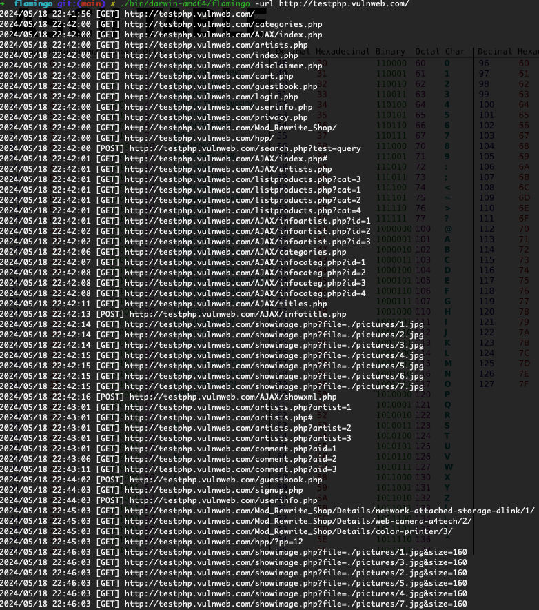

# Flamingo 🦩

[](https://go.dev/)
[](LICENSE)

**Flamingo** 是一个基于 Headless Chrome 的开源浏览器爬虫工具，用于收集 HTTP 请求对象。收集到的请求对象可以提供给漏洞扫描器，以帮助检测网站 Web 漏洞。

> ⚠️ **重要提示**：安装使用之前，请务必阅读并同意 [免责声明](./disclaimer.md) 中的条款，否则请勿安装使用本工具。

## ✨ 特性

### 核心功能
- 🌐 驱动 Headless Chrome，构建原生浏览器爬虫
- 🔗 遍历 DOM 节点，获取页面中静态链接，包括注释中的链接
- 🎯 使用 Hook 技术收集 DOM 0级和 DOM 2级事件，并自动化触发
- 👀 监控 DOM 变化，发现动态产生的链接
- 📝 遍历表单节点，自动化填充和提交表单

### 增强功能
- 🔍 **深度 URL 发现**
  - 从内联事件处理器（onclick、onload 等）中提取 URL
  - 从 `<script>` 标签内容中提取硬编码的 URL 和路径
  - 从 CSS 样式中提取 URL
  - 从 XHR/Fetch 响应的 JSON 中提取 URL
  - Hook History API（pushState、replaceState、hashchange）
  - 自动解析 robots.txt 和 sitemap.xml 获取种子 URL
  - 扩展链接属性检测（支持 action、formaction、data-* 等 15+ 属性）

- ⚡ **性能优化**
  - 动态并发调整（基于响应时间和错误率自动调节）
  - URL 归一化和智能去重
  - 优化的连接池（HTTP/2 支持，更高的并发限制）
  - 扩展资源阻断（减少不必要的资源加载）

- 🛡️ **健壮性改进**
  - 分级错误处理和自动重试（指数退避）
  - 标签页崩溃自动恢复
  - 优雅关闭（确保中断时保存结果）
  - 结构化日志系统（支持文件输出和日志级别）
  - 内存管理（请求数量限制、定期 GC）

## 📦 安装

### 环境要求

- Go 1.25 或更高版本
- Chrome / Chromium 浏览器

### 从源码编译

```bash
# 克隆仓库
git clone https://github.com/phplaber/flamingo.git
cd flamingo

# 编译所有平台
make build_all
```

编译完成后，二进制文件将生成在 `bin/` 目录下：

```
bin/
├── darwin-amd64/flamingo    # macOS
├── linux-amd64/flamingo     # Linux
└── windows-amd64/flamingo   # Windows
```

在 Linux 或 macOS 平台上运行，请确保二进制程序具有可执行权限：

```bash
chmod +x ./bin/darwin-amd64/flamingo
```

## 🚀 使用方法

### 前置准备

使用 Flamingo 前，请先下载 [Chromium](https://www.chromium.org/getting-involved/download-chromium) 可执行程序，并通过 `-chromium_path` 参数指定路径。

> 💡 在已安装 Chrome 的系统上，如果不指定路径，程序将自动从默认安装路径查找并启动 Chrome。

### 基本用法

```bash
./bin/darwin-amd64/flamingo -url http://testphp.vulnweb.com/
```

### 命令行参数

```bash
./bin/darwin-amd64/flamingo -h
```

| 参数 | 说明 | 默认值 |
|------|------|--------|
| `-url` | 目标 URL（必填） | - |
| `-chromium_path` | Chromium 可执行文件路径 | 系统默认路径 |
| `-cookie` | HTTP Cookie（如 `"PHPSESSID=a8d127e.."`) | - |
| `-ua` | User-Agent 请求头 | `flamingo` |
| `-output_path` | 输出 JSON 文件路径 | `requests.json` |
| `-gui` | 启用图形界面模式（非 headless） | `false` |
| `-tab_concurrent_quantity` | 并发标签页数量 | `3` |
| `-tab_timeout` | 单个标签页超时时间 | `3m` |
| `-wait_js_exec_time` | 等待 JS 执行超时时间 | `1m` |
| `-crawl_total_time` | 爬虫总超时时间 | `30m` |
| `-trigger_event_interval` | 事件触发间隔（毫秒） | `5000` |
| `-progress_interval` | 进度输出间隔 | `2s` |
| `-verbose` | 详细输出模式 | `false` |
| `-quiet` | 静默模式（仅显示错误） | `false` |
| `-log_path` | 日志文件路径 | 标准错误输出 |
| `-log_level` | 日志级别（debug/info/warn/error） | `info` |
| `-seed_urls` | 从 robots.txt 和 sitemap.xml 获取种子 URL | `true` |
| `-max_requests` | 最大存储请求数量 | `100000` |
| `-version` | 显示版本号 | - |

### 示例

```bash
# 基本爬取
./bin/darwin-amd64/flamingo -url https://example.com/

# 带 Cookie 认证
./bin/darwin-amd64/flamingo -url https://example.com/ -cookie "session=abc123"

# 使用图形界面模式调试
./bin/darwin-amd64/flamingo -url https://example.com/ -gui

# 指定 Chromium 路径并增加并发
./bin/darwin-amd64/flamingo -url https://example.com/ \
  -chromium_path /path/to/chromium \
  -tab_concurrent_quantity 5

# 详细模式，显示完整进度信息
./bin/darwin-amd64/flamingo -url https://example.com/ -verbose

# 静默模式，仅显示错误
./bin/darwin-amd64/flamingo -url https://example.com/ -quiet

# 启用日志文件和调试级别
./bin/darwin-amd64/flamingo -url https://example.com/ \
  -log_path flamingo.log \
  -log_level debug

# 禁用种子 URL 获取
./bin/darwin-amd64/flamingo -url https://example.com/ -seed_urls=false
```

## 📸 运行截图



## 📄 输出格式

爬取完成后，结果将保存到 JSON 文件（默认 `requests.json`），包含收集到的所有 HTTP 请求对象。

## 📜 开源许可

本项目基于 [GPL-2.0](LICENSE) 许可证开源。

## 🙏 致谢

- [chromedp](https://github.com/chromedp/chromedp) - Go 语言的 Chrome DevTools Protocol 客户端
- [goquery](https://github.com/PuerkitoBio/goquery) - Go 语言的 HTML 解析库
