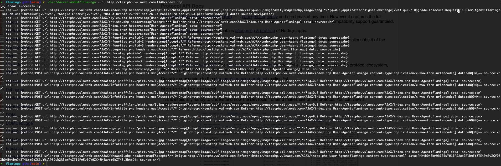

## flamingo

**flamingo** 是一个开源的浏览器爬虫工具，用于收集 HTTP 请求对象。将这些请求对象提供给漏洞扫描器，以帮助检测 Web 漏洞。

### 特性

1.  驱动 Headless Chrome，搭建原生浏览器爬虫环境；
2.  遍历 DOM 节点，获取页面中静态链接，包括注释中的链接；
3.  使用 Hook 技术收集 DOM 0级和 DOM 2级事件，并自动化触发；
4.  监控 DOM 变化，发现动态产生的链接；
5.  遍历表单节点，自动化填充和提交表单。

### 安装

**安装使用之前，请务必阅读并同意 [免责声明](./disclaimer.md) 中的条款，否则请勿安装使用本工具。**

#### 编译

```bash
$ make build_all
```

在 Linux 或 Darwin 平台上运行，请赋予二进制程序可执行权限。

#### 运行

```bash
$ ./flamingo -h

NAME:
   flamingo - A browser crawler for web vulnerability scanner

USAGE:
   flamingo [global options] url

VERSION:
   0.0.1

AUTHOR:
   yns0ng <phplaber@gmail.com>

COMMANDS:
   help, h  Shows a list of commands or help for one command

GLOBAL OPTIONS:
   --config file, -c file  Load options from a config file
   --output-json file      custom output json file path, saved full request dump
   --log-level value       custom log level (debug|info|warn|error|fatal)
   --gui                   display browser GUI (default: false)
   --help, -h              show help
   --version, -v           print the version
```

### 使用

使用 flamingo 前，请先下载 [Chromium]((https://www.chromium.org/getting-involved/download-chromium)) 可执行程序，并配置文件 flamingo.yml 中的配置项 **chromium_path**。

flamingo 默认从同级目录的 flamingo.yml 文件中加载配置项，也可以使用 **--config** 选项指定任意路径的配置文件。

```bash
$ ./flamingo --output-json testphp.json http://testphp.vulnweb.com/
```

运行结果截图：

